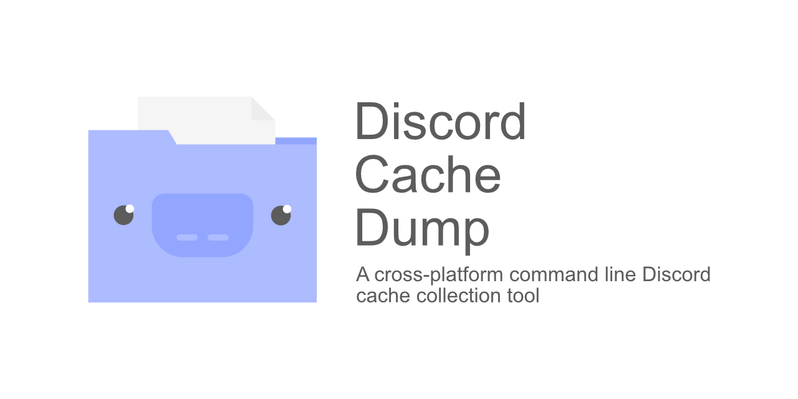

# Discord Cache Dump

## About

Discord Cache Dump is a tool that gathers the cache of all known Electron Discord client builds, copies into their corresponding build directories, and gives the files their appropriate file extensions.

## Features

- Detection of known Discord build types (can do multiple in a single run)
- Discloses count of amount of files it is unable to gather at the time for that particular build
- Supports Windows, GNU/Linux, and macOS
- Checks storage available where the program is being ran before copying
- Dumps are timestamped along with the cache being in their own build type directories
- Select specific build type with the `--build` (or `-b`) flag (i.e. `./dcd --build stable`)
- Non-interactive mode by using the `--noninteractive` (or `-n`) flag (i.e. `./dcd --noninteractive`) 

## Known limitations

- The files that a Discord client process is utilising at the time cannot be copied over as it involves opening
  - It is advised to kill the parent process of the client(s) you wish to copy files from that contains strings of *potentially sensitive* data
- Due to how cache is stored in later GNU/Linux builds, this program includes a file extraction function 
  - .MOV files cannot be completely extracted
  - Some .GZ (gzip) files containing mentions of .JS cannot be completely extracted
  - Some cache files containing request and response data cannot be completely extracted
  - Cache files that cannot be handled at all will not have their contents altered as they are being copied over

## Always opened files
The following files are known to be used constantly by Discord and so cannot be copied while that Discord client is running.

| File   | Contents                                                                                         |
| ------ | ------------------------------------------------------------------------------------------------ |
| index  | Cache index                                                                                      |
| data_0 | Unknown                                                                                          |
| data_1 | Full URLs to friendly URLs, API, avatars, emojis, embeds, attachments, uploads (self and others) |
| data_2 | Code, assets (png, svg)                                                                          |
| data_3 | Certificates, hostnames, IP addresses, image EXIF, references to javascript assets (webpack)     |

## Prerequisites

In order to compile the tool, there are a few things required to get it set up.

- Go (compiling)
- [h2non/filetype](https://github.com/h2non/filetype) (recognition of file types and extensions): `go get github.com/h2non/filetype`
- [ricochet2200/go-disk-usage](https://github.com/ricochet2200/go-disk-usage) (disk information): `go get github.com/ricochet2200/go-disk-usage/du`
- [jessevdk/go-flags](https://github.com/jessevdk/go-flags) (flag handling): `github.com/jessevdk/go-flags`

## Usage

| Platform  | Command                                                |
| --------- | ------------------------------------------------------ |
| Windows   | `dcd_windows.exe`                                      |
| GNU/Linux | `./dcd_linux` (run `chmod +x ./dcd_linux` initially)   |
| macOS     | `./dcd_darwin` (run `chmod +x ./dcd_darwin` initially) |

## Credits
| User                                        | Contribution                                                                        |
| ------------------------------------------- | ----------------------------------------------------------------------------------- |
| [NodePoint](https://github.com/NodePoint)   | Research &amp; analysis, development, Windows, GNU/Linux and macOS platform testing |
| [NotZoeyDev](https://github.com/NotZoeyDev) | macOS platform testing                                                              |
| [@not_utf16](https://twitter.com/not_utf16) | GNU/Linux platform testing                                                          |

## Tested
- Windows 10
- Ubuntu (GNU/Linux)
- Kali Linux (GNU/Linux)
- Solus (GNU/Linux)
- macOS
